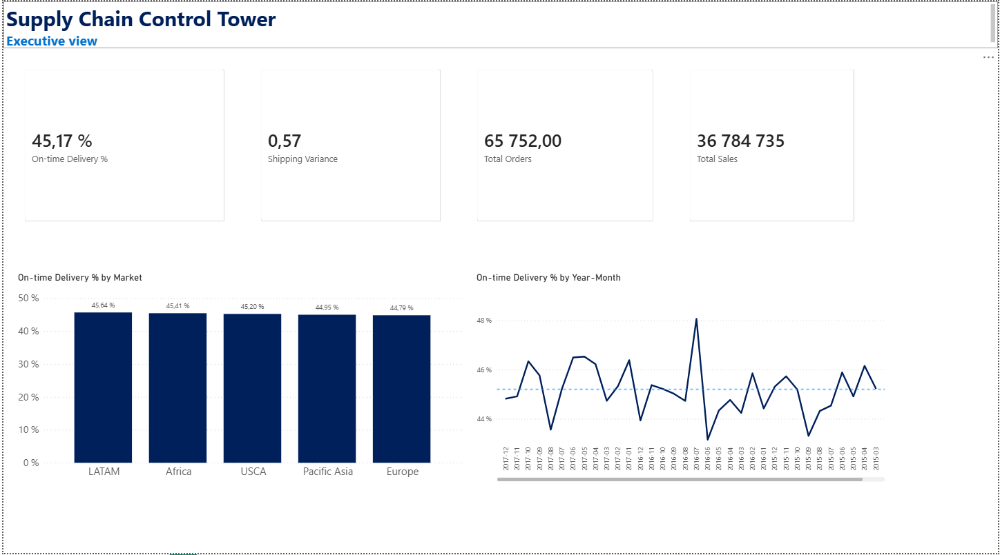
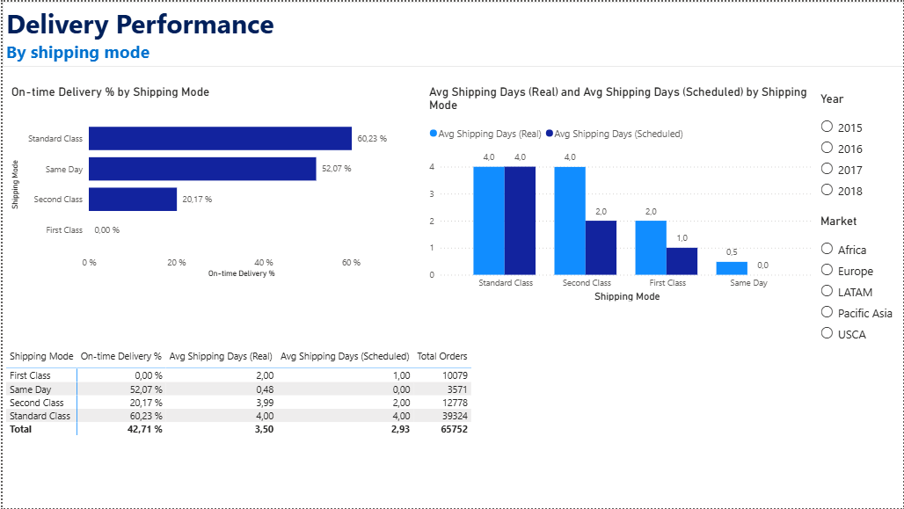

# Supply Chain Control Tower Power BI Dashboard (IN PROGRESS)

Interactive delivery-performance dashboard built on the **DataCo Smart Supply Chain** dataset (180K+ order lines, 65,752 orders): on-time delivery monitoring, real vs scheduled shipping analysis, and row-level security.

>  Companion project: [supply-chain-control-tower-sql](https://github.com/PetiteReb/supply-chain-control-tower-sql) -> the same dataset rebuilt as a PostgreSQL star-schema warehouse. Together they cover the full BI chain: raw data → SQL warehouse → semantic model → dashboard.

## Business Context

In aerospace supply chain (Airbus, Toulouse), I built simulation and monitoring dashboards used for capacity planning decisions. This project reproduces that "control tower" approach on a public dataset: monitor deliveries, find out *why* they are late, and quantify the fix.

## Key Insight

Delivery delays are not driven by geography or seasonality — they are driven by **over-promising on premium shipping tiers**:

| Shipping Mode | Orders | On-time % | Real days | Promised days |
|---|---:|---:|---:|---:|
| Standard Class | 39,324 (60%) | 61.9% | 4.00 | 4.00  |
| Same Day | 3,571 | 54.3% | 0.48 | 0.00 |
| Second Class | 12,778 | 23.4% | 3.99 | 2.00  |
| First Class | 10,079 | 4.7% | 2.00 | 1.00  |

**Recommendation:** recalibrate promised lead times on First/Second Class — operational performance is stable; the promises are not realistic.

## Dashboard Pages

1. **Executive Overview**  headline KPIs, orders by market and year
2. **Delivery Performance** on-time % by shipping mode, real vs scheduled days, summary matrix, Year/Market slicers




## Data Model

Star schema: `Facts_Order` (fact) + `Dim_Date`, `Dim_Customer`, `Dim_Product` dimensions, plus a `UserSecurity` mapping table for dynamic RLS.

## Securit  Row-Level Security (RLS)

- **Static role**  `Europe Manager`: `Facts_Order[Market] = "Europe"`
- **Dynamic role**  `Regional Manager`:

```dax
[Market] = LOOKUPVALUE(
    UserSecurity[Market],
    UserSecurity[Email], USERPRINCIPALNAME()
)
```

Tested in Desktop with *View as* + *Other user*; unmapped users see no data (fail-closed).

## Roadmap  v2 "Simulation" (in progress)


- [ ] **What-if parameters** (sliders) simulate SLA recalibration and demand scenarios
- [ ] **Scenario switching**  baseline vs adjusted assumptions
- [ ] **Geographic view**  order latitude/longitude on Azure Maps
- [ ] **Drillthrough** to order-level detail + report tooltip pages
- [ ] **Field parameters** user-selected metrics and dimensions
- [ ] Bookmarks & page navigation

## Tech Stack

Power BI Desktop · DAX · Star schema modeling · RLS
Dataset: [DataCo Smart Supply Chain (Kaggle)](https://www.kaggle.com/datasets/shashwatwork/dataco-smart-supply-chain-for-big-data-analysis) — not committed here (~95 MB)

## About Me

**Rebecca Olivier**  Data & Analytics Consultant
Aerospace & supply chain background (Airbus, Bombardier, Thales) · relocating to Ontario, Canada 🇨🇦
[LinkedIn](https://linkedin.com/in/rebeccaolivier-/) · rebecca.olivier28@gmail.com
